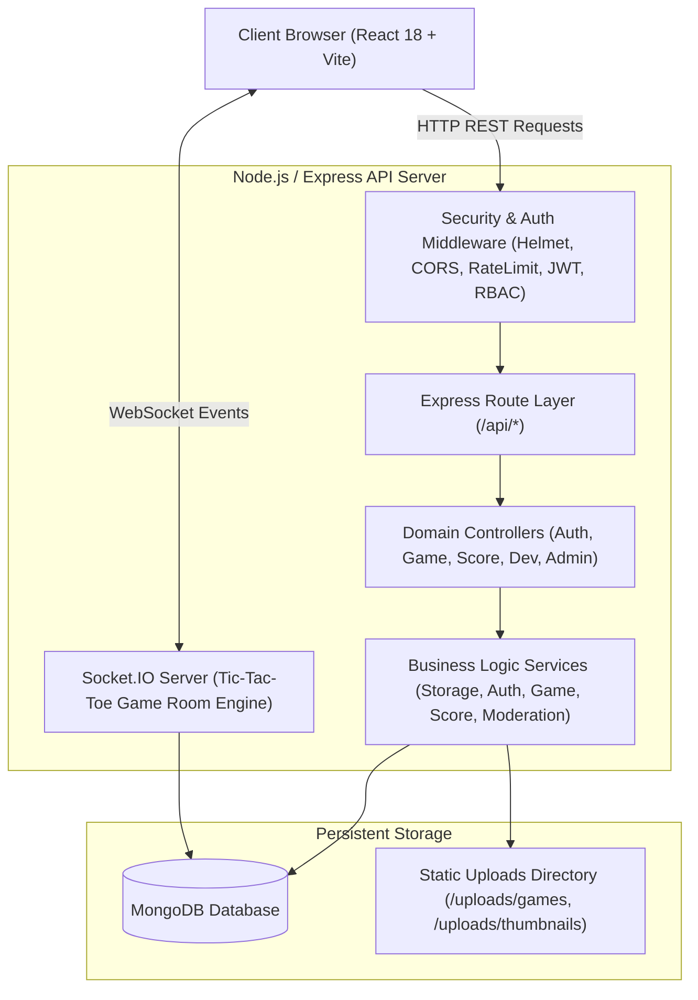

# PlayPortal — Technical Architecture Document

## 1. Architectural Philosophy
PlayPortal is architected as a **Modular Monolith** designed for high maintainability, low deployment complexity, and college viva defensibility. It eliminates unnecessary distributed system overhead (no microservices, no Redis, no Kafka) while maintaining strict layer separation between transport, business logic, and data persistence.

---

## 2. High-Level Architecture Diagram



---

## 3. Frontend Architecture

### State Management & Context
Instead of heavyweight external state libraries (Redux/MobX), PlayPortal utilizes React's built-in **Context API** (`AuthContext`):
- Centralizes user session state, JWT tokens, and role booleans (`isAdmin`, `isDeveloper`).
- Restores authentication upon page refresh via background `GET /api/auth/me` verification.
- Intercepts outgoing Axios requests to inject `Authorization: Bearer <token>` headers.
- Intercepts incoming 401 responses to purge expired tokens safely.

### Routing & Security Boundaries
Configured with **React Router v6**:
- **Public Routes:** `/`, `/login`, `/register`, `/games`, `/games/:id`, `/games/:id/play`, `/games/:id/leaderboard`, `/multiplayer`, `/multiplayer/room/:roomId`
- **Protected Routes:** Wrapped with `<ProtectedRoute />` checking `isAuthenticated`.
- **Role-Guarded Routes:** Wrapped with `<ProtectedRoute allowedRoles={['DEVELOPER', 'ADMIN']} />` (Developer dashboard, game uploads) and `<ProtectedRoute allowedRoles={['ADMIN']} />` (Submissions queue, user accounts).

### Untrusted Game Execution Architecture
Uploaded HTML5 games are executed within an HTML `<iframe>` sandboxed with:
```html
sandbox="allow-scripts allow-same-origin allow-forms allow-popups"
```
When gameplay concludes, the game dispatches a standard `window.parent.postMessage({ type: 'PLAYPORTAL_GAME_OVER', score: number }, '*')` message. The parent React application listens for this event and displays the `ScoreSubmitModal` for verified score posting.

---

## 4. Backend Architecture

### Layered Separation of Concerns
1. **Routing Layer (`src/routes/`):** Declares endpoint URL patterns, attaches input validation schemas (`express-validator`), and binds role guards (`authenticate`, `authorize`).
2. **Controller Layer (`src/controllers/`):** Extracts HTTP parameters, query strings, uploaded files, invokes service methods, and maps outcomes to standard JSON HTTP responses.
3. **Service Layer (`src/services/`):** Implements pure business logic, database queries, file extractions, and error generation with HTTP status codes.
4. **Data Access Layer (`src/models/`):** Mongoose schemas enforcing schema-level constraints, indexing, and serialization transforms.

### Middleware Execution Pipeline

```
Incoming Request
       │
       ▼
1. Helmet (Security Headers)
       │
       ▼
2. CORS Handler (Origin validation)
       │
       ▼
3. Rate Limiter (100 req / 15 min on /auth)
       │
       ▼
4. Body Parsers (express.json, express.urlencoded)
       │
       ▼
5. Morgan Logger (Development mode)
       │
       ▼
6. Authentication & RBAC Guard (JWT verify, active status check)
       │
       ▼
7. Route Controller & Business Logic
       │
       ▼
8. Centralized Error Handler (Formatted JSON response)
```

---

## 5. Storage & File Extraction Architecture

```
server/uploads/
├── temp/                  # Temporary staging for incoming raw ZIP uploads
├── thumbnails/            # Verified game cover images (JPG, PNG, WEBP, SVG)
└── games/
    └── <gameId>/          # Unzipped, validated HTML5 game package
        ├── index.html     # Required web entry point
        ├── game.js
        └── assets/
```

- **Zip Slip Defense:** Every entry in uploaded ZIP archives is validated prior to writing. The system verifies `path.resolve(targetDir, entryName).startsWith(targetDir)`. Any traversal attempt (such as `../../evil.js`) immediately triggers an exception and cleans up temporary files.
- **Entry Point Verification:** The extraction engine verifies the existence of `index.html` (case-insensitive) at the root or within the top-level directory before committing the game to storage.
- **Cleanup Guarantee:** If validation or database creation fails, extracted folders and temp files are deleted immediately.

---

## 6. Real-Time Multiplayer Architecture (Socket.IO)

The Tic-Tac-Toe multiplayer system follows a **Server-Authoritative State Engine**:
- **Room Management:** Rooms are identified by unique 6-character uppercase codes (`ROOMID`).
- **Turn Authority:** Board state (`Array(9)`), active turn (`'X'` vs `'O'`), and player assignments are stored in server memory.
- **Move Validation:** Moves are accepted only if:
  1. Room status is `IN_PROGRESS`.
  2. Socket belongs to the player whose turn it is.
  3. Cell index is valid (0–8) and currently unoccupied.
- **Win & Draw Resolution:** The server checks the 8 geometric winning lines on the 3x3 board.
- **Match Logging:** Once completed, the match outcome is written to MongoDB (`matches` collection) for player profile statistics.
