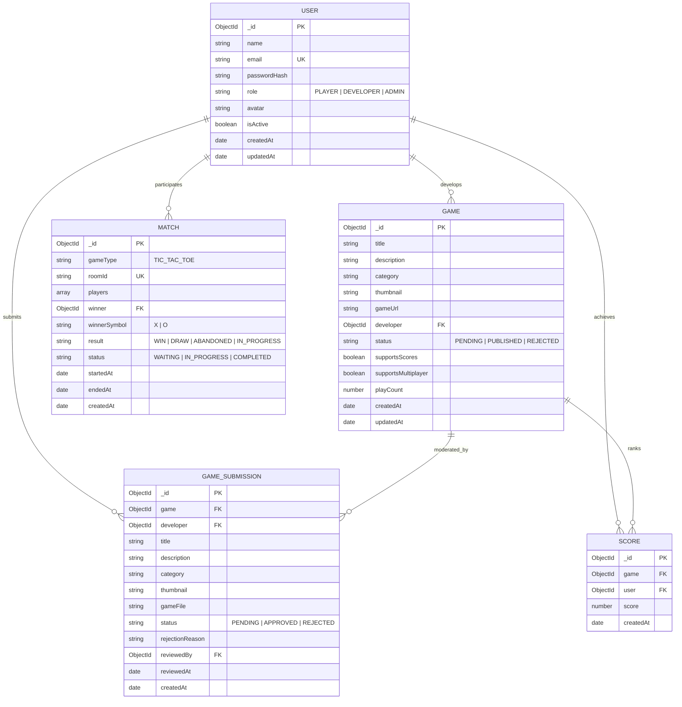

# PlayPortal — Database Design & Schema Specification

## 1. Entity Relationship Overview

---

## 2. Collection Schemas & Field Details

### A. `users` Collection
- **`name`** (`String`, required, trim, minlength: 2, maxlength: 50)
- **`email`** (`String`, required, unique, lowercase, trim, regex validated)
- **`passwordHash`** (`String`, required, `select: false` — never returned in default queries)
- **`role`** (`String`, enum: `['PLAYER', 'DEVELOPER', 'ADMIN']`, default: `'PLAYER'`)
- **`avatar`** (`String`, default: `''`, trim)
- **`isActive`** (`Boolean`, default: `true`)
- **`timestamps`** (`createdAt`, `updatedAt`)

### B. `games` Collection
- **`title`** (`String`, required, trim, minlength: 2, maxlength: 100)
- **`description`** (`String`, required, trim, maxlength: 2000)
- **`category`** (`String`, enum: `['Action', 'Arcade', 'Puzzle', 'Strategy', 'Sports', 'Casual', 'Retro', 'Card']`)
- **`thumbnail`** (`String`, relative URL e.g. `/uploads/thumbnails/...`)
- **`gameUrl`** (`String`, relative URL e.g. `/uploads/games/<gameId>/index.html`)
- **`developer`** (`ObjectId`, ref: `User`, required, indexed)
- **`status`** (`String`, enum: `['PENDING', 'PUBLISHED', 'REJECTED']`, default: `'PENDING'`, indexed)
- **`supportsScores`** (`Boolean`, default: `true`)
- **`supportsMultiplayer`** (`Boolean`, default: `false`)
- **`playCount`** (`Number`, default: 0, min: 0)
- **`timestamps`** (`createdAt`, `updatedAt`)

### C. `gameSubmissions` Collection
- **`game`** (`ObjectId`, ref: `Game`, required, indexed)
- **`developer`** (`ObjectId`, ref: `User`, required, indexed)
- **`title`**, **`description`**, **`category`**, **`thumbnail`** (`String`)
- **`gameFile`** (`String`, original filename of uploaded ZIP)
- **`status`** (`String`, enum: `['PENDING', 'APPROVED', 'REJECTED']`, default: `'PENDING'`, indexed)
- **`rejectionReason`** (`String`, default: `''`)
- **`reviewedBy`** (`ObjectId`, ref: `User`, default: `null`)
- **`reviewedAt`** (`Date`, default: `null`)
- **`timestamps`** (`createdAt`, `updatedAt`)

### D. `scores` Collection
- **`game`** (`ObjectId`, ref: `Game`, required, indexed)
- **`user`** (`ObjectId`, ref: `User`, required, indexed)
- **`score`** (`Number`, required, min: 0)
- **`createdAt`** (`Date`, default: `Date.now`)

### E. `matches` Collection
- **`gameType`** (`String`, default: `'TIC_TAC_TOE'`)
- **`roomId`** (`String`, required, unique, indexed)
- **`players`** (`Array` of `{ user: ObjectId, name: String, symbol: 'X'|'O', socketId: String }`)
- **`winner`** (`ObjectId`, ref: `User`, default: `null`)
- **`winnerSymbol`** (`String`, enum: `['X', 'O']`, default: `null`)
- **`result`** (`String`, enum: `['WIN', 'DRAW', 'ABANDONED', 'IN_PROGRESS']`, default: `'IN_PROGRESS'`)
- **`status`** (`String`, enum: `['WAITING', 'IN_PROGRESS', 'COMPLETED']`, default: `'WAITING'`)
- **`startedAt`**, **`endedAt`** (`Date`)
- **`timestamps`** (`createdAt`, `updatedAt`)

---

## 3. Indexes & Query Performance

| Collection | Indexed Fields | Query Purpose |
| :--- | :--- | :--- |
| `users` | `{ email: 1 }` (Unique) | O(1) user lookup during login and duplicate registration check |
| `games` | `{ status: 1, category: 1, createdAt: -1 }` | Fast category filtering and newest/popular catalog browsing |
| `games` | `{ title: "text", description: "text" }` | Full-text game search |
| `scores` | `{ game: 1, score: -1, createdAt: -1 }` | Compound index for instantaneous top-N leaderboard generation |
| `scores` | `{ user: 1, createdAt: -1 }` | Fast player history timeline retrieval |
| `gameSubmissions` | `{ status: 1, createdAt: -1 }` | Admin moderation queue sorting and status filtering |
| `matches` | `{ roomId: 1 }` (Unique) | Instant room lookup by code |
| `matches` | `{ "players.user": 1, createdAt: -1 }` | Player multiplayer match history retrieval |
