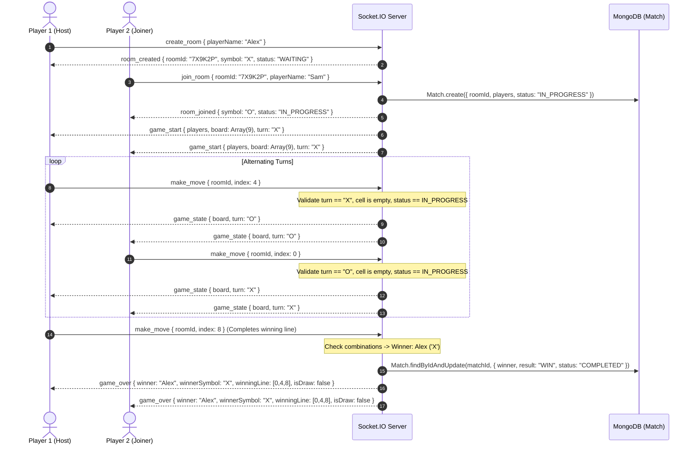

# PlayPortal — Real-Time Multiplayer Specification (Tic-Tac-Toe)

## 1. Overview & Protocol
PlayPortal implements a real-time 1v1 multiplayer **Tic-Tac-Toe** game using **Socket.IO** (WebSockets with HTTP long-polling fallback). The multiplayer engine is strictly **server-authoritative**, meaning clients only send intent to move (`make_move`), while the server validates rules, tracks turns, detects victories/draws, and persists match records.

---

## 2. Multiplayer State Lifecycle



---

## 3. Socket.IO Events Reference

### Client -> Server Events
| Event | Payload | Description |
| :--- | :--- | :--- |
| `create_room` | `{ playerName, userId }` | Creates a new match room and registers creator as Player 'X'. |
| `join_room` | `{ roomId, playerName, userId }` | Joins an existing room code as Player 'O' and begins match. |
| `make_move` | `{ roomId, index }` | Submits a requested move on cell index `0` to `8`. |
| `play_again` | `{ roomId }` | Requests a rematch. When both players confirm, the board resets. |
| `leave_room` | `{ roomId }` | Forfeits match and closes room. |

### Server -> Client Events
| Event | Payload | Description |
| :--- | :--- | :--- |
| `room_created` | `{ roomId, playerSymbol: 'X', room }` | Acknowledges room creation. |
| `room_joined` | `{ roomId, playerSymbol: 'O', room }` | Acknowledges joiner admission. |
| `game_start` | `{ roomId, players, board, turn, status }` | Broadcast to both players to start match. |
| `game_state` | `{ board, turn, lastMove }` | Broadcasts board updates after verified moves. |
| `game_over` | `{ board, winner, winnerSymbol, winningLine, isDraw }` | Announces game outcome. |
| `game_restarted`| `{ board, turn, players }` | Broadcasts reset board when rematch starts. |
| `player_left` | `{ message, leavingPlayer, winner }` | Notifies remaining player of opponent departure. |
| `error_message`| `{ message }` | Transmits error (e.g. invalid code, room full). |

---

## 4. Algorithmic Win & Draw Verification

The server checks the board against the 8 geometric winning combinations:
```javascript
const WINNING_COMBINATIONS = [
  [0, 1, 2], [3, 4, 5], [6, 7, 8], // Rows
  [0, 3, 6], [1, 4, 7], [2, 5, 8], // Columns
  [0, 4, 8], [2, 4, 6]             // Diagonals
];
```
- **Victory Condition:** If any combination has identical non-empty symbols `board[a] === board[b] && board[a] === board[c]`, that player is declared the winner, and `winningLine` is returned for visual highlighting.
- **Draw Condition:** If all 9 cells are filled (`board.every(cell => cell !== '')`) with no winning line, the match ends as `DRAW`.
- **Abandonment / Disconnect:** If an active match player disconnects, the remaining player is credited with a forfeit victory (`MATCH_RESULT.ABANDONED`).
